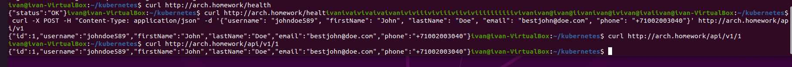

Скрин:

----------------------------------------------------

Инструкция по установке:
----------------------------------------------------
Запустить команды из директории kubernetes
1) kubectl apply -f configmap.yaml
2) kubectl apply -f secret.yaml
3) kubectl apply -f dp.yaml
4) kubectl apply -f service.yaml
5) kubectl apply -f ingress.yaml
База данный in-memory
